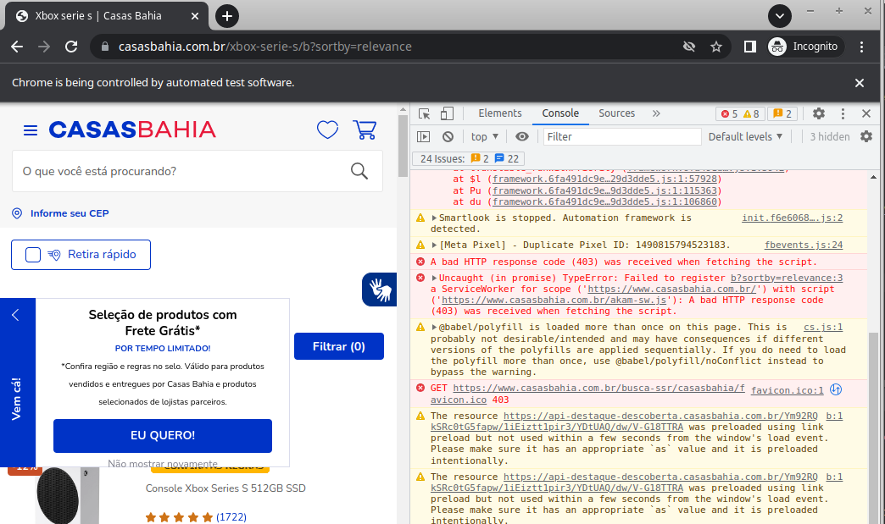
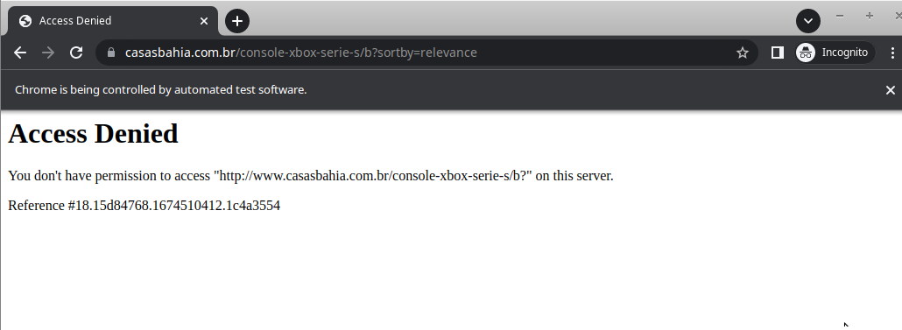

# nexum-rpa-test:

-- -

### Test done as a step for the interview

## Instructions

* Before run the project, init the docker-compose.yml

### use `docker-compose up` inside the project folder then, after that, the project will be able to run.

###           

## Some observations:

### During I'm realizing, I've noted that the CasasBahia's website get a protection about webScraping and all automations ("Automation framework is detected" in console).

### After this, when you reload the page, you will get forever an access denied message.

